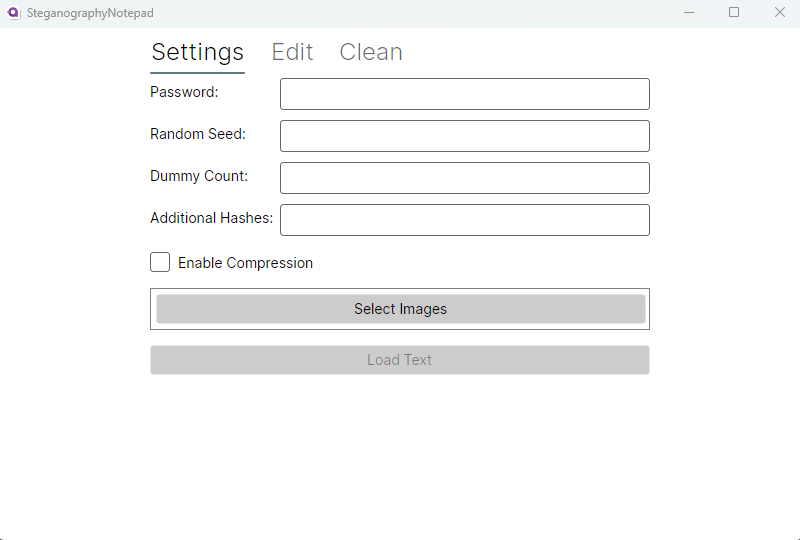

# Steganography Nodepad
The Steganography Nodepad is a UI wrapper for the [SteganographyApp](https://github.com/AndrewEC/SteganographyApp) command line utility.

This application provides limited functionality to allow one to use the SteganographyApp to save encrypted and obfuscated text to one
or more images.

## Usage

The application can be launched by executing the following command from the root of the project:
> dotnet run

### Settings Tab
The first screen is where you will find the settings.

Below are the list of settings and what they do.

**Important**: If you provide any value for the Password, Random Seed, Dummy Count, or Additional Hashes you *must* re-enter said values when trying to load the text from the selected images. If you forget any one of these values then your text will be lost.

* *Select Images* - This is the only required setting. In order to save/load text from an image you must select at least one image. The image must either be a .png image or a lossless .webm.
* *Password* - If provided the app will encrypt/decrypt any text stored.
* *Random Seed* - If provided the text content will be randomized before being stored.
* *Dummy Count* - If provided random bits of data will be inserted into the text before being stored.
* *Additional Hashes* - If provided this will alter the number of times the Password is hashed before being used to encrypt/decrypt the text.

### Edit Tab
The edit screen has only two components. A text field where any of you can input your text to save and a single button to save said text to the selected image(s).

Additionally, whenever you click *Load Text* from the *Settings* tab you will automatically be taken to the *Edit Tab* and the input area will automatically be failed with whatever text was loaded from the selected image(s).

*Note*: By default both of these will be disabled and won't be enabled until you select at least one image using the *Select Images* button from the *Settings* tab.

### Clean Tab
The last tab allows you to "clean" the images selected on the *Settings* tab.

The app "cleans" the images by effectively overwriting key parts of the image with random bits of data and effectively destroy the original text saved within the selected image(s).
